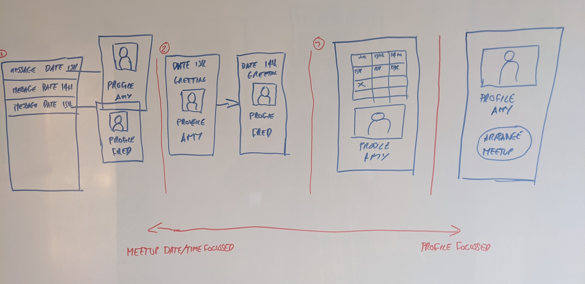

## The app can pivot along the path but the vision should stay intact.

The initial vision for the app is 2 things:

* It is better for people to get out and actually meet people in person to help them socialize resulting in a more connected world.
* To find a friend it is better to actually meetup rather than chatting for ages on an app, you wont tell if you click anyway unless you meetup.

## Why has the question of meetup or profile focussed arisen.

After the first initial release and interviewing users a few people said they found it difficult to arrange a time.  
This is from a tiny user base, 5 people interviewed so the idea needs explored but may not be indicative of a wider problem.  
Hatty suggested that she would really want to meet with someone if their profile had something she clicked with.

Exploring the idea leads to whether the app should be meetup or profile focussed.

## What problem are we trying to solve for the user.

What is the problem that we are trying to solve for the user, is it:

* For people to make new friends.
* For people to make acquaintances, many friends.
* For people to get out and socialize more by meeting up with people, the pandemic plays a large part in this.

The above may depend on the following:

* Does a user enjoy going out and socializing meeting new people for a coffee.
* Does a user want to meet a new friend as soon as possible and finds meeting new people for a coffee awkward.

My hope is that people want to get out and socialize meet new people (especially after the pandemic) and through this also make new friends, as such the app should be able to solve both problems.

## Different versions of the app for the different problems we are trying to solve.

The app could function in a few different ways that would focus on either the meetup or the profile.

__Option 1, select meetup from list then shows profile.__

Current MVP release, this is too meetup focussed, users will want to see a profile blurb and image anyways.

__Option 2, swipe left and right through profiles by date.__

Swipe through profiles based on date and time of meetup, the meetup date time are shown on the same screen.

This is one less click to see the profile, it has the profile and the date on the same screen so focusses on the meetup and the profile.

If a user has multiple slots available this would show up as the duplicate profiles but with different dates.

__Option 3, swipe through profiles, a profile has a calendar of when they are available for a coffee.__

This is becoming more profile based, here users are swiping through profiles and it will show when users are available to meet.

This has the benefit that a profile is automatically visable so they have automatically posted.
The UI is much less intuitive having to have a calendar with multiple dates selectable.

__Option 4, swipe through profiles then click arrange meetup.__

This is profile based you would then click arrange meetup to arrange to meet for a coffee.

This is getting more like tinder but for friends.

### Different views on the same data.

The above options are different views on the same data, for example the user could be seeing meetups as in option 2 then select display collapsed and it would show the display as in option 3, the problem with this is that we want to keep the UI as simple as possible.

## Outcome what do we build for the next phase.

I think we can be sure that users care about the profile of who they meet up with.  
We dont know whether users only care about the profile and see the meetup just as a necessary thing to meet other people.
Moving to profile based would be a divergence in how we develop the app.

For the next release we build option 2 as this still fits into the vision.  
When we get more users we keep questioning to see what option would suit different people, we should re-asses whether we are on the right path once we have more data.

A good suggestion is to have some functionality to be able to suggest a time to a user, this could be a paid feature, add this feature to the backlog.

Thanks to Hatty and Amy on the feedback around profile and meetup views.